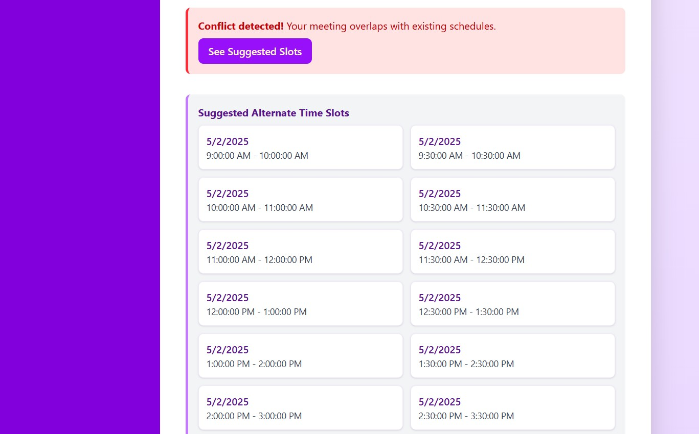

# Meeting Scheduler with Conflict Detection
A full-stack meeting scheduler application with conflict detection, user-friendly interface , and advanced features such as best slot suggestions and user authentication.


A full-stack meeting scheduler application with conflict detection, real-time updates, and advanced features such as best slot suggestions and user authentication.

# Tech Stack

- *Frontend*: React (with hooks), TailwindCSS for UI styling
- *Backend*: Node.js with Express
- *Database*: MongoDB


# Key Features


## 1. User Authentication
- *Register/Login*: Allows users to sign up and log in to the app.
- *JWT-based Authentication*: Ensures secure login sessions using JWT tokens.
- *Role-based Access*: Supports different roles (User vs Admin).


## 2. Meeting Creation
- *Create Meetings*: Users can create meetings with:
  - Title
  - Description
  - Start and End Time
  - Participants (via email or user ID)
- *Conflict Detection*: The backend checks for scheduling conflicts before saving a new meeting.


## 3. Calendar View (Frontend)
- *Weekly/Daily Views*: Users can view their meetings in either a weekly or daily view.
- *Conflict Highlighting*: Conflicting meetings are highlighted for easy identification.
- *Filter by User/Team* : Users can filter meetings by individual or team.


## 4. Best Slot Suggestion
- *Suggest Available Time Slots*: The app can suggest available time slots based on working hours and existing schedules for a group of users.



## 5. Conflict Detection
- *Prevent Double-Booking*: The backend ensures that users cannot book overlapping meetings.
- *Rescheduling Suggestions*: If a conflict is detected, the app suggests alternate available times.


# Getting Started
Prerequisites
-Node.js (v14 or higher)
-MongoDB (local or cloud instance)

# Installation

Follow these steps to set up the project locally:

1. Clone the repository:
   ```bash
   git clone https://github.com/nandiayan73/Meeting-Scheduler

2. Navigate to the project directory:
    ```bash
    cd Meeting-Scheduler

3. Install all dependencies for both frontend and backend:
    ```bash
    npm run install-all

4. Set up environment variables: Create a .env file in the root directory and configure the following variables:
    ```bash
    JWT_SECRET=<Your_JWT_SECRET>
    DB_NAME=<MongoDB_DATABASE_NAME>
    DB_PASS=<MONGODB_PASSWORD>
    COOKIE_SECRET=<COOKIE_SECRET>
    MAIL=<MAILID_FOR_SENDING_MAIL>
    MAILPASSWORD=<APP_PASSWORD>
    ADMIN_SECRET=<Admin_SECRET_FOR_ADMIN_LOGIN>
*Put this .env file inside the Server folder for correct configuration*
Enter this admin secret while registering the admin, if not entered in default it will take it as "Admin" 

5. Install concurrently if it is not installed:
    ```bash
    npm install concurrently

6. Start both the client (React) and the server (Node.js + Express) together:
    ```bash
    npm run dev

# Contributing
Contributions are welcome! Please fork the repository and submit a pull request with your changes.

# License
This project is licensed under the MIT License. See the LICENSE file for details.
 
